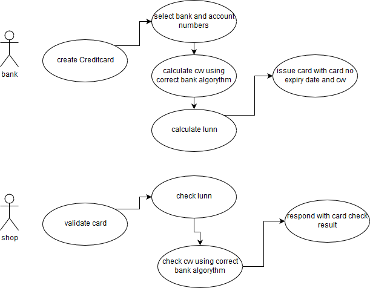
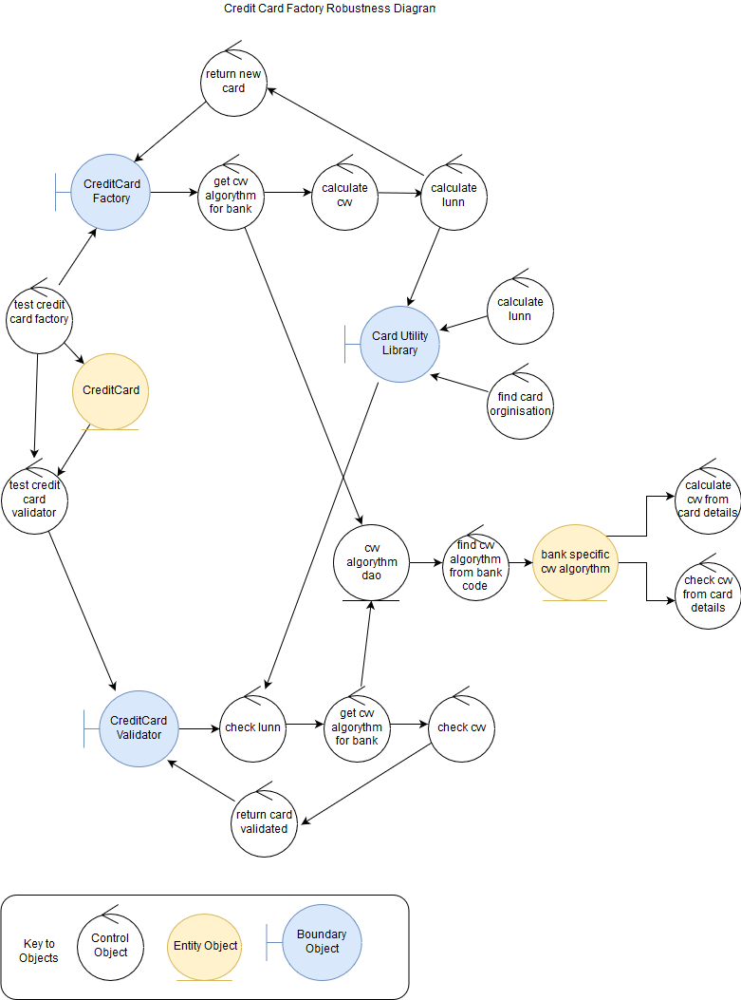
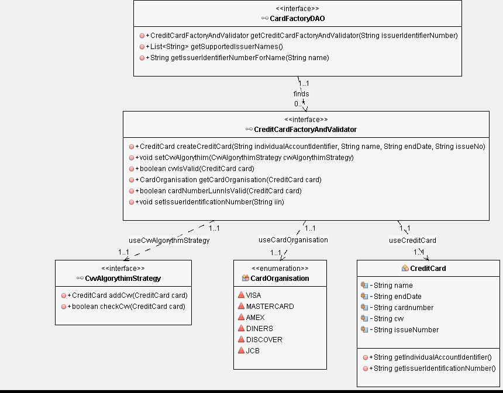

# Credit Cards Use Case
We need to design a library for managing the issue and verification of credit/payment cards. This library can be used by banks for issuing new credit cards and for verifying credit cards presented for a transaction. The library can also be used in point of sales terminals and in shopping cart web sites to pre check credit cards before forwarding a transaction request to a bank.

## Credit Card fields
Credit cards have a number of fields
* Card number (PAN)
* Expiry Date (MMYY)
* Name
* CVV ( 3 or 4 digit number printed on card as additional check)

## Credit Card Numbers
The structure of all industry standard credit cards are described here
https://en.wikipedia.org/wiki/Payment_card_number

The main credit card number, also called a primary account number (PAN) consists of:
* A six-digit Issuer Identification Number (IIN), the first digit of which is the major industry identifier (MII).  (This is also called bank identification numbers if the card is a bank card)
* A variable length (up to 12 digits)  primary account number (PAN) (also called an individual account identifier)
* A single check digit calculated using the Luhn algorithm
Ranges of Issuer Identification Numbers are associate with the major credit card systems, Visa, Mastercard etc. 

Individual banks are allocated specific IIN/BIN numbers. Some examples are provided below

* List of IIN numbers https://stevemorse.org/ssn/List_of_Bank_Identification_Numbers.html
* Bank of Scotland BIN numbers https://www.creditcardvalidator.org/bank-of-scotland

## Credit Card Security
Credit cards have a CVV code printed  on the card https://en.wikipedia.org/wiki/Card_security_code
The CVV is usually calculated from the card number, date and name using a secret algorithm which is unique to each bank. 
The same algorithm is used to issue the card and to check the card in no card present transactions. 
The CVV is sent with a transaction request but is NEVER STORED in any logs or tables in the systems as this would be a potential vulnerability
Similarly, logs and receipts of credit card transactions should only contain the last 4 digits of the PAN

## Task
You need to write a set of requirements which describe all of the operations which a façade needs to perform in order to issue and verify a credit card. Banks need to be able to supply a cvv algorithm to the mechanism. You need to also describe  a set of tests to prove the library

# Credit Card payments

See https://en.wikipedia.org/wiki/Payment_card_number
Every card has;
* a six-digit[2] Issuer Identification Number (IIN),[a] the first digit of which is the major industry identifier (MII)
* a variable length (up to 12 digits) individual account identifier
* a single check digit calculated using the Luhn algorithm[4]

# Draw IO

We will be constructing our use cases using Draw IO

Draw IO (https://www.draw.io/) is a simple on line javascript based drawing library which can construct UML diagrams in your browser. 
Images can be saved and loaded as xml files within your project and exported as images which can be included in your documentation.

# card Creation and validation use case diagram

# Card Creation and validation Robustness Diagram 

# Card Creation and validation Class Diagram

